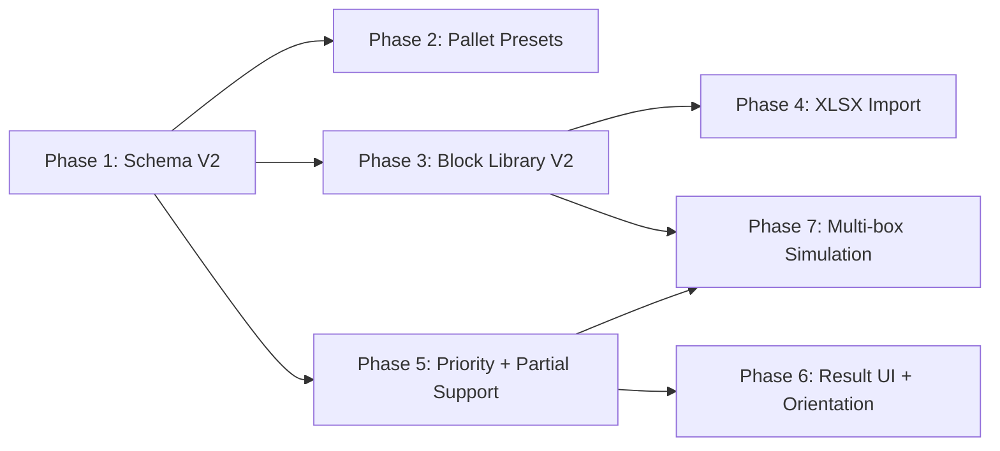

# Package Tetris V2 Field Feedback Roadmap

> **For Claude:** REQUIRED SUB-SKILL: Use superpowers:executing-plans to implement each V2 phase task-by-task.

**Goal:** 현장 사용자 피드백을 V2 범위로 분리하고, `v2` 브랜치에서 기능 확장과 엔진 정책 변경을 안정적으로 진행한다.

**Architecture:** V1은 현장 테스트용 안정 버전으로 동결한다. V2는 프론트 단독 구조를 유지하되, 박스 라이브러리 스키마, 적재 정책, 결과 3D 표현, 추가박스 시뮬레이션을 단계적으로 확장한다. 모든 계산 정책 변경은 적재 엔진, 결과 검증, 추가 시뮬레이션에서 같은 정책 객체를 공유해야 한다.

**Tech Stack:** Next.js App Router, React client components, TypeScript, Three.js client-only renderer, IndexedDB workspace persistence, JSON backup, Node test runner, `.xlsx` browser file import.

---

## 1. Product Manager Scope Decision

### 1.1 V1 동결

- V1은 현장 작업자가 `main` 브랜치 기준으로 테스트하는 버전이다.
- 현장 피드백 기반의 추가 기능 개발은 V1에 넣지 않는다.
- V1에서 아직 처리하지 못한 후보 기능도 모두 V2 backlog로 이동한다.
- V1에는 치명적인 실행 불가, 데이터 손실, 빌드 실패, 보안성 문제만 hotfix로 반영한다.

### 1.2 V2 브랜치 운영

- V2 작업 기준 브랜치: `v2`
- `main`은 현장 테스트 안정 브랜치로 유지한다.
- V2 안정화 후 병합 방향: `v2 -> main`
- 각 기능 증분은 가능한 작은 커밋으로 나누고, 검증이 끝난 변경만 원격 `v2`에 push한다.
- V2 기능 개발 중 main의 hotfix가 발생하면 `main -> v2`로 먼저 반영해 테스트 기준을 맞춘다.

### 1.3 V2 우선순위 원칙

1. 계산 정합성: 공간 경계, 충돌, 지지면, 깨짐주의 정책이 깨지면 기능 완료로 보지 않는다.
2. 현장 사용성: IT 비전문 사용자가 태블릿 또는 PC에서 검색, 선택, 계산, 확인까지 수행해야 한다.
3. 대량 데이터 대응: 저장 박스 200개 수준에서도 검색, 그룹, 일괄등록이 사용 가능해야 한다.
4. 단계적 안정화: 데이터 스키마 변경과 엔진 정책 변경은 UI보다 먼저 테스트로 고정한다.

### 1.4 Phase Dependency Rule

V2는 아래 순서를 기본 의존성으로 삼는다. 뒤 phase가 앞 phase의 데이터 구조나 정책을 전제로 하므로, 특별한 사유 없이 순서를 바꾸지 않는다.



Phase 4는 Phase 3의 그룹/무게 필드를 사용한다. Phase 7은 Phase 3의 대량 박스 선택 UI와 Phase 5의 적재 정책을 모두 사용한다. Phase 6은 Phase 5의 결과 검증을 신뢰하므로 엔진 정책보다 먼저 진행하지 않는다.

## 2. Confirmed Decisions

| 항목 | 확정 결정 |
| --- | --- |
| 부분 지지 기능 명칭 | `부분 지지 허용`을 사용한다. |
| 지지면 비율 표기 | `55%`는 버튼/체크박스 이름에 직접 붙이지 않고 설명 문구, 상태 문구, 검증 결과에 별도 표기한다. |
| 배치상세 / 쌓는순서 | 메인 결과 화면에서 제거한다. 작업지시서와 내부 데이터 산출물에서도 삭제한다. |
| 배치상세 / 쌓는순서 삭제 범위 | 3D 렌더링과 안전 검증에 필요한 `PackedBlock` 좌표 데이터는 유지한다. 단, 배치 상세표, 쌓는 순서표, 텍스트 다운로드/복사/모달 산출물은 제거 대상이다. |
| 일괄등록 범위 | `.xlsx` 업로드까지만 V2 목표로 잡는다. CSV 우선 구현은 하지 않는다. |
| V1 추가 개발 | 하지 않는다. 모든 현장 피드백 반영은 V2에서 진행한다. |

### 2.1 Product Manager Final Review Notes

역할별 재검토 결과, 기존 로드맵의 방향은 유지한다. 다만 다음 항목을 최종 기준으로 추가한다.

- V1 문서는 역사적 기준 문서로 남길 수 있다. 단, V2 사용자 가이드와 V2 기획 문서는 작업지시서 제거, 추가박스 5단계, 부분 지지 허용 정책을 반영해야 한다.
- `작업지시서/배치상세/쌓는순서` 삭제는 화면 버튼 제거만 의미하지 않는다. 관련 모달, 텍스트 다운로드, 복사 상태, field handoff checklist 항목, 문서 참조, 테스트까지 같이 정리한다.
- `무게`는 V2 field metadata다. V2 첫 범위에서는 검색, 표시, import/export에만 사용하고 적재 엔진에는 반영하지 않는다.
- `부분 지지 허용`은 공격적인 현장 판단 옵션이다. 기본값은 OFF이며, 실행 전 확인과 추가박스 시뮬레이션 양쪽에 같은 정책 설명을 보여준다.
- `.xlsx` import는 비신뢰 입력으로 처리한다. 파일 확장자, MIME, sheet 구조, 컬럼명, 숫자 범위, 빈 행, 중복, prototype pollution 방어를 테스트 대상으로 둔다.

## 3. Field Feedback Coverage Check

| 원문 항목 | V2 반영 계획 | 누락 여부 | 비고 |
| --- | --- | --- | --- |
| 1-1 기본 파레트 `1100*1100*1550`, 오버행 파레트 `1150*1150*1550`, 안전 여유 0 | Phase 2에서 preset 추가/수정 | 없음 | 기존 `preset-pallet-1150` 호환성 처리 필요 |
| 1-2 안전여유를 초과하면 오버행 파레트 전향 알림 | Phase 2에서 오버행 추천 계산 | 없음 | 자동 변경하지 않고 추천/미리보기 |
| 2-1 박스 등록에 무게 추가, 필수 아님 | Phase 3에서 `weightKg` optional 추가 | 없음 | 적재 계산에는 우선 미반영 |
| 2-1 기본 수량 데이터 삭제 | Phase 3에서 템플릿 기본 수량 제거 | 없음 | 현재 작업 수량 입력은 유지 |
| 2-2 TextBox 클릭 시 기본 글자 삭제 | Phase 3에서 placeholder/select-on-focus 정책 적용 | 없음 | 사용자 입력값은 임의 삭제하지 않음 |
| 2-3 저장 박스 200개 검색/그룹화 | Phase 3에서 검색/상위그룹/하위그룹 필터 | 없음 | 그룹은 2단계 고정으로 시작 |
| 2-3 상위그룹/하위그룹 | Phase 3에서 `group1`, `group2` 도입 | 없음 | 예: `금영 -> 스피커` |
| 2-3 엑셀 시트 일괄 등록 | Phase 4에서 `.xlsx` import | 없음 | 저장 박스와 현재 작업 물량 모두 업로드 전 미리보기/오류 행 표시 |
| 3-1 원하는 화물을 아래층 우선 적재 | Phase 5에서 작업 단위 `loadPriority` 추가 | 없음 | 템플릿 전역값이 아니라 이번 작업 기준 |
| 4-1 배치상세/쌓는순서 불필요 | Phase 6에서 UI/산출물 제거 | 없음 | 기존 테스트/문서도 정리 |
| 4-2 제품 방향 화살표 | Phase 6에서 3D 방향 표시 | 없음 | 원래 입력 높이 방향을 기준으로 표시 |
| 4-2 100% 지지면 조건을 55%까지 허용 | Phase 5에서 `부분 지지 허용` 정책 추가 | 없음 | 기본 OFF, 실행 전 확인에서 선택 |
| 4-2 추가 시뮬레이션에도 동일 적용 | Phase 7에서 multi simulation에 정책 전달 | 없음 | 기존 chain validation도 같은 정책 사용 |
| 5 추가박스 시뮬레이션을 5단계로 구성 | Phase 7에서 단계 분리 | 없음 | 결과 후속 단계로 노출 |
| 5-1 현재 공간 제품 외 제품 선택 | Phase 7에서 저장 박스 전체 검색/그룹 선택 | 없음 | Phase 3의 라이브러리 UI 재사용 |
| 5-2 최대 3개 선택 | Phase 7에서 선택 제한 | 없음 | 4개 이상 선택 시 안내 |
| 5-3 현재 적재 상태 기반 최적화 | Phase 7에서 base result locked simulation | 없음 | 남는 부피 최소화를 추천 결과로 정의 |
| 5-4 최적화/A우선/B우선 결과 | Phase 7에서 variant result 모델 | 없음 | 선택 박스 수에 따라 우선 결과 생성 |

## 4. V2 Data Model Plan

### 4.1 Workspace Schema

V2는 `WORKSPACE_SCHEMA_VERSION`을 올린다. 기존 V1 IndexedDB와 JSON 백업 파일은 V2 로드 시 자동 보정한다.

```ts
export const WORKSPACE_SCHEMA_VERSION = 2;
```

### 4.2 Block Template

박스 템플릿은 저장 라이브러리의 재사용 단위다. 수량과 적재 우선순위는 작업마다 달라질 수 있으므로 템플릿에 저장하지 않는다.

```ts
interface BlockTemplate {
  blockTemplateId: string;
  entityVersion: number;
  name: string;
  dimensions: Dimensions;
  fragile: boolean;
  weightKg?: number | null;
  group1?: string;
  group2?: string;
  createdAt: string;
  updatedAt: string;
}
```

### 4.3 Draft Block Item

현재 작업에 추가된 박스 단위다. 수량과 하단 우선순위는 여기서 관리한다.

```ts
interface DraftBlockItem {
  draftBlockItemId: string;
  blockTemplateId: string;
  quantity: number;
  loadPriority?: number | null;
  createdAt: string;
  updatedAt: string;
}
```

### 4.4 Block Definition

엔진 입력에는 템플릿 정보와 작업 단위 정책을 합친다.

```ts
interface BlockDefinition {
  blockId: string;
  blockTemplateId: string;
  draftBlockItemId: string;
  entityVersion: number;
  name: string;
  dimensions: Dimensions;
  quantity: number;
  fragile: boolean;
  weightKg?: number | null;
  group1?: string;
  group2?: string;
  loadPriority?: number | null;
  createdAt: string;
  updatedAt: string;
}
```

### 4.5 Placement Policy

`부분 지지 허용`은 모든 적재 계산과 검증에서 공유한다.

```ts
interface PlacementPolicy {
  fragileStackOnFragileAllowed: boolean;
  nonFragileOnFragileAllowed: boolean;
  partialSupportEnabled: boolean;
  minimumSupportRatio: number; // default 1, partial support mode 0.55
}
```

UI 문구는 `부분 지지 허용`을 사용하고, 설명에 `받침면 55% 이상이면 적재 가능으로 계산`을 표시한다.

## 5. V2 Phase Plan

### Phase 1. V2 기준 문서와 스키마 마이그레이션 준비

**Goal:** V2 작업 기준을 문서화하고 V1 데이터가 V2에서 깨지지 않도록 migration 설계를 고정한다.

**Files:**
- Modify: `src/lib/workspace/types.ts`
- Modify: `src/lib/workspace/workspace-factory.ts`
- Modify: `src/lib/persistence/json-transfer.ts`
- Modify: `src/lib/persistence/json-transfer.test.ts`
- Modify: `src/lib/persistence/indexed-db.test.ts`
- Modify: `src/components/tetris-workspace-app.tsx`

**Tasks:**
1. `WORKSPACE_SCHEMA_VERSION`을 2로 올리는 실패 테스트를 먼저 작성한다.
2. V1 JSON import가 V2 workspace로 보정되는 테스트를 작성한다.
3. V1 IndexedDB record load 후 `normalizeWorkspace`가 V2 필드를 채우는 테스트를 작성한다.
4. 신규 필드 기본값을 정의한다.
5. V2 export JSON이 V2 schema와 신규 policy/metadata 필드를 포함하는지 테스트한다.
6. `npm test`, `npx tsc --noEmit`, `npm run build`를 실행한다.

**Acceptance Criteria:**
- V1 백업 JSON을 V2에서 가져올 수 있다.
- V1 IndexedDB 작업본을 V2에서 열 수 있다.
- 신규 필드는 없거나 null이어도 화면과 엔진이 실패하지 않는다.

### Phase 2. 파레트 preset과 오버행 추천

**Goal:** 현장 기준 파레트 공간을 기본 제공하고, 기본 파레트에서 아쉽게 공간이 늘어나는 경우 오버행 파레트를 검토하도록 추천한다.

**Files:**
- Modify: `src/lib/workspace/presets.ts`
- Modify: `src/lib/workspace/workspace-factory.ts`
- Modify: `src/lib/workspace/result-offset-recommendation.ts`
- Modify: `src/lib/workspace/result-offset-recommendation.test.ts`
- Modify: `src/components/tetris-workspace-app.tsx`
- Modify: `docs/tetris-ui-planning-draft.md`

**Tasks:**
1. `기본 파레트` preset 테스트를 작성한다: `1100 x 1100 x 1550`, offset `0`.
2. `오버행 파레트` preset 테스트를 작성한다: `1150 x 1150 x 1550`, offset `0`.
3. 기존 `preset-pallet-1150` 저장 호환성 처리 방식을 테스트로 고정한다.
4. 기본 파레트 결과가 오버행 파레트에서 공간 수 감소 또는 미적재 감소로 개선되는 케이스를 테스트한다.
5. 오버행 추천이 `부분 지지 허용` OFF/ON 정책 각각에서 현재 결과와 같은 policy로 재계산되는지 테스트한다.
6. 결과 화면에 `오버행 파레트 검토` 추천 카드를 추가한다.

**Acceptance Criteria:**
- 신규 작업의 기본 선택 공간은 `기본 파레트`다.
- 오버행 추천은 자동 적용되지 않는다.
- 추천에는 현재 공간 수, 오버행 검토 시 공간 수, 현장 확인 안내가 표시된다.

### Phase 3. 박스 라이브러리 V2

**Goal:** 저장 박스가 약 200개까지 늘어나도 검색, 그룹 필터, 재사용이 가능하게 한다.

**Files:**
- Modify: `src/lib/workspace/types.ts`
- Modify: `src/lib/workspace/block-library.ts`
- Modify: `src/lib/workspace/block-library.test.ts`
- Modify: `src/lib/workspace/block-library-search-layout.test.ts`
- Modify: `src/components/tetris-workspace-app.tsx`
- Modify: `src/app/globals.css`

**Tasks:**
1. `BlockTemplate`의 `weightKg`, `group1`, `group2` 저장/수정 테스트를 작성한다.
2. 템플릿 생성 form에서 `기본 수량`을 제거한다.
3. 수량은 `이번 작업에 추가` 액션에서만 입력하도록 분리한다.
4. 텍스트/숫자 입력의 기본값을 placeholder 또는 focus select 방식으로 바꾼다.
5. 검색 대상에 이름, 치수, 깨짐주의, 무게, 상위그룹, 하위그룹을 포함한다.
6. 라이브러리 상단에 상위그룹/하위그룹 필터를 추가한다.
7. 360px, 390px에서 필터와 카드가 가로 넘치지 않도록 layout test를 추가한다.

**Acceptance Criteria:**
- 박스 저장 시 무게는 비워 둘 수 있다.
- 신규 박스 등록 화면에 기본 수량 필드가 없다.
- 저장 박스 200개 기준으로 검색/필터 후 원하는 박스를 찾을 수 있다.
- 사용자가 입력하려고 할 때 예시 문구를 직접 지우지 않아도 된다.

### Phase 4. `.xlsx` 일괄등록

**Goal:** 현장 사용자가 엑셀 파일로 대량 박스 데이터를 가져올 수 있게 한다.

**Files:**
- Create: `src/lib/workspace/block-template-xlsx-import.ts`
- Create: `src/lib/workspace/block-template-xlsx-import.test.ts`
- Create: `src/lib/workspace/draft-block-xlsx-import.ts`
- Create: `src/lib/workspace/draft-block-xlsx-import.test.ts`
- Modify: `src/components/tetris-workspace-app.tsx`
- Modify: `src/app/globals.css`
- Modify: `docs/field-demo-user-guide.md`

**Tasks:**
1. 사용할 `.xlsx` parser 라이브러리를 고정 버전으로 추가한다.
2. 저장 박스 템플릿 컬럼을 확정한다: `상위그룹`, `하위그룹`, `박스명`, `가로mm`, `세로mm`, `높이mm`, `무게kg`, `깨짐주의`.
3. 현재 작업 물량 컬럼을 확정한다: `박스명`, `작업수량`, `아래층우선타입` 3개 컬럼만 받는다.
4. `.xlsx` 첫 번째 sheet를 읽어 import 후보로 변환하는 실패 테스트를 작성한다.
5. 필수값 누락, 숫자 오류, 중복 박스명, 음수/0 치수 오류 테스트를 작성한다.
6. 허용되지 않는 파일 확장자, 빈 workbook, 빈 sheet, 알 수 없는 컬럼, prototype pollution key 방어 테스트를 작성한다.
7. 업로드 후 즉시 저장하지 않고 `미리보기 -> 오류 확인 -> 가져오기` 흐름으로 구현한다.
8. 현재 작업 import는 저장된 박스명과 정확히 일치하는 행만 현재 작업에 추가하고, 없는 박스명은 오류 행으로 안내한다.
9. 현재 작업 import는 저장 박스 템플릿을 새로 만들지 않는다. 저장되지 않은 박스명은 박스 등록 또는 저장 박스 일괄등록을 먼저 진행하도록 오류 행으로 안내한다.
10. 가져오기 결과에 성공 건수, 실패 행, 중복 처리 결과를 표시한다.
11. 라이브러리 bundle 영향과 static export build 통과 여부를 확인한다.

**Acceptance Criteria:**
- `.xlsx` 파일만 선택 가능하다.
- 오류가 있는 행은 저장하지 않고 행 번호와 사유를 보여준다.
- 정상 행만 가져오기 또는 전체 취소가 가능하다.
- 저장 박스 import로 가져온 박스는 그룹/검색에서 바로 찾을 수 있다.
- import 실패 후에도 기존 저장 박스와 현재 작업은 변경되지 않는다.
- 현재 작업 `.xlsx` import는 `작업수량`과 숫자형 `아래층우선타입` 값을 함께 반영한다.
- 저장 박스 등록 샘플과 현재 작업 샘플을 각각 내려받을 수 있다.

**2026-06-11 implementation note:**
- 저장 박스 일괄등록과 별도로 현재 작업 물량 `.xlsx` import를 추가했다. 현재 작업 샘플은 `박스명`, `작업수량`, `아래층우선타입` 순서를 사용한다.
- 현재 작업 import는 파일 선택 즉시 반영하지 않고 `현재 작업 엑셀 미리보기`에서 `추가할 박스`와 `오류 행`을 확인한 뒤 `현재 작업에 추가`로 적용한다.
- 현재 작업 import는 `박스명 / 작업수량 / 아래층우선타입` 3개 컬럼만 받는다. 박스명은 저장된 박스 라이브러리에 반드시 있어야 하며, 없는 박스명은 새 저장 박스로 만들지 않고 오류 행으로 안내한다. `아래층우선타입`은 1=기본, 2=먼저바닥에, 3=맨아래우선 숫자만 허용한다.
- 현재 작업 카드의 `총 부피` 타일이 1280px 현장 PC 폭에서 깨지지 않도록 전용 칼럼과 최소 폭을 적용했다.
- 현장 UI 피드백에 따라 현재 작업 import에도 `엑셀 포맷 보기` dialog를 추가했다. 저장 박스 import와 동일하게 열 설명, 샘플 행, 샘플 다운로드, 파일 선택 CTA를 제공한다.
- 3번 섹션 카드에서 `이번 작업에서 제거` 버튼이 총 부피 타일 때문에 그리드 밖으로 밀리지 않도록 제거 버튼을 전체 폭 액션 행으로 분리하고, 회귀 layout test에 제거 버튼 overflow 방지 조건을 추가했다.

### Phase 5. 실행 전 확인 V2: 우선순위와 부분 지지 허용

**Goal:** 현장 작업자가 아래층 우선 적재와 55% 받침면 정책을 명시적으로 선택할 수 있게 한다.

**Files:**
- Modify: `src/lib/workspace/types.ts`
- Modify: `src/lib/workspace/review-gate.ts`
- Modify: `src/lib/workspace/review-gate.test.ts`
- Modify: `src/lib/workspace/packing-placement.ts`
- Modify: `src/lib/workspace/packing-engine.ts`
- Modify: `src/lib/workspace/packing-output-safety.ts`
- Modify: `src/lib/workspace/packed-result-validation.ts`
- Modify: `src/lib/workspace/chain-simulation.ts`
- Modify: `src/lib/workspace/packing-engine.test.ts`
- Modify: `src/lib/workspace/packed-result-validation.test.ts`
- Modify: `src/lib/workspace/chain-simulation.test.ts`
- Modify: `src/components/tetris-workspace-app.tsx`

**Tasks:**
1. `loadPriority`가 높은 박스를 먼저 배치하는 실패 테스트를 작성한다.
2. 같은 우선순위 안에서는 기존 결정론적 정렬이 유지되는 테스트를 작성한다.
3. `부분 지지 허용` OFF에서 기존 100% 지지면 규칙이 유지되는 테스트를 작성한다.
4. `부분 지지 허용` ON에서 받침면 55% 이상이면 배치되는 테스트를 작성한다.
5. 받침면 50% 또는 54.9%는 배치되지 않는 테스트를 작성한다.
6. 깨짐주의 정책이 부분 지지 모드에서도 유지되는 테스트를 작성한다.
7. support block이 여러 개인 경우 지지면 합산 또는 union-area 계산 방식이 double count를 만들지 않는지 테스트한다.
8. 실행 전 확인에 `부분 지지 허용` 체크박스와 55% 설명 문구를 추가한다.
9. 추가 시뮬레이션도 같은 policy를 받도록 구조를 확장한다.

**Acceptance Criteria:**
- 사용자가 지정한 우선순위 박스가 가능한 한 먼저 낮은 층에 배치된다.
- 부분 지지 옵션은 기본 OFF다.
- 옵션 ON 시 55% 이상 받침면만 허용된다.
- 3D 결과에 공중 배치, 충돌, 공간 경계 초과가 없다.
- 결과 경고와 실행 전 확인 문구는 이 기능이 현장 판단이 필요한 적재 옵션임을 알려준다.

**2026-06-11 implementation note:**
- 작업별 하단 우선 설정 UI를 현재 작업 박스 카드에 연결했다. 저장된 박스 템플릿은 그대로 두고 `DraftBlockItem.loadPriority`만 갱신하므로, 같은 박스도 출고 작업마다 `기본` / `먼저 바닥에` / `맨 아래 우선`을 다르게 지정할 수 있다.
- UI 문구는 숫자 우선순위 대신 현장 작업자가 바로 판단할 수 있는 3단계 버튼으로 제공한다. 내부 값은 0/5/10으로 정규화되어 기존 엔진의 `loadPriority` 정렬과 결과 최신성 fingerprint에 반영된다. V1/외부 백업에서 숫자 단계가 다르게 들어오면 5 미만은 기본, 5 이상 10 미만은 `먼저 바닥에`, 10 이상은 `맨 아래 우선`으로 보정한다.
- 실행 전 확인 카드에는 하단 우선으로 지정한 현재 작업 항목 수와 박스별 수량/단계를 요약한다. 작업자가 결과 만들기 직전에 우선 적재 설정 여부를 다시 확인할 수 있게 하기 위함이다.
- 회귀 테스트는 작업 항목 단위 저장, 저장 템플릿 비변경, 가져오기 우선순위 보정, 실행 전 확인 요약, 모바일 48px 터치 타깃을 확인한다.

### Phase 6. 결과 확인 V2: 불필요 상세 삭제와 방향 화살표

**Goal:** 결과 화면 시인성을 높이고, 3D에서 박스가 어느 방향으로 눕거나 세워졌는지 바로 알 수 있게 한다.

**Files:**
- Modify: `src/components/tetris-workspace-app.tsx`
- Modify: `src/components/result-stage/result-3d-canvas.client.tsx`
- Modify: `src/lib/workspace/packing-scene.ts`
- Modify: `src/lib/workspace/packing-scene.test.ts`
- Delete: `src/lib/workspace/placement-detail-table.ts`
- Delete: `src/lib/workspace/placement-detail-table.test.ts`
- Delete: `src/lib/workspace/placement-detail-table-layout.test.ts`
- Delete: `src/lib/workspace/stacking-layer-summary.ts`
- Delete: `src/lib/workspace/stacking-layer-summary.test.ts`
- Delete: `src/lib/workspace/stacking-layer-summary-layout.test.ts`
- Modify: `src/lib/workspace/field-handoff-checklist.ts`
- Modify: `src/lib/workspace/field-handoff-checklist.test.ts`
- Modify: `src/lib/workspace/field-handoff-checklist-layout.test.ts`
- Modify: `src/lib/workspace/workspace-migration.ts`
- Modify: `src/lib/persistence/json-transfer.test.ts`
- Verify absent: `src/lib/workspace/loading-instruction-file.ts`
- Verify absent: `src/lib/workspace/loading-instruction-file.test.ts`
- Modify: `docs/development-deliverables.md`
- Modify: `docs/tetris-ui-planning-draft.md`
- Modify: `docs/field-demo-user-guide.md`

**Tasks:**
1. `배치상세` 버튼 제거 layout test를 작성한다.
2. `쌓는순서` 버튼 제거 layout test를 작성한다.
3. 작업지시서/텍스트 다운로드에서 배치 상세표와 쌓는 순서 산출물을 제거한다.
4. field handoff checklist에서 작업지시서 준비/저장 상태를 제거하고, 결과 확인과 백업 상태 중심으로 재구성한다.
5. `PackedBlock.rotation` 기준으로 원래 높이 축 방향을 계산하는 유틸 테스트를 작성한다.
6. 3D 박스에 방향 화살표를 렌더링한다.
7. `방향 표시` 토글을 추가해 복잡한 결과에서 화살표를 숨길 수 있게 한다.
8. WebGL fallback 상태에서 방향 화살표가 없어도 결과 확인이 가능한 문구를 유지한다.
9. V1 historical docs와 V2 active docs를 구분한다. `docs/v1-readiness.md`는 V1 기준 문서로 유지하고, V2 사용자 가이드는 별도 최신 흐름을 반영한다.
10. JSON 백업/복원 경로에서 legacy 배치상세/쌓는순서/작업지시서 필드가 다시 내보내지지 않도록 결과와 추가 시뮬레이션 이력을 whitelist 정규화한다.

**Acceptance Criteria:**
- 메인 결과 화면에 `배치상세`, `쌓는순서` 액션이 없다.
- 관련 작업지시서/내부 산출물에도 해당 데이터가 없다.
- JSON import/export를 반복해도 legacy 배치상세/쌓는순서/작업지시서 필드가 재수출되지 않는다.
- 각 박스는 원래 입력 기준 위쪽 방향을 화살표로 보여준다.
- 화살표는 박스 선택, 공간 전환, 카메라 조작을 막지 않는다.
- V2 문서에는 작업지시서 생성 흐름이 남아 있지 않다.

**2026-06-11 implementation note:**
- `현장 전달 전 점검`은 작업지시서 준비 상태 대신 `최신 결과`, `3D와 공간 확인`, `미적재/경고`, `백업 상태` 네 항목으로 구성한다.
- `3D와 공간 확인`은 시스템 완료가 아니라 현장 사용자가 직접 확인할 항목으로 유지한다.
- `recentResults`와 `chainHistory`는 import/migration 시 허용 필드만 재구성해 legacy 산출물 필드를 백업 파일 밖으로 제거한다.
- `exportWorkspaceToJson`도 같은 허용 필드 재구성을 적용해 런타임 작업본에 legacy 필드가 섞여도 백업 파일로 재수출하지 않는다.
- `docs/v1-readiness.md`는 V1 역사 기준 문서로 유지하되, V2에서는 작업지시서 대신 3D와 공간 확인 흐름을 사용한다는 경계 문구를 둔다.
- 활성 V2 문서와 현장 가이드는 배치상세/쌓는순서/작업지시서 생성 흐름을 안내하지 않는다.
- 활성 V2 판단 기준은 이 로드맵, `docs/tetris-ui-planning-draft.md`, `docs/field-demo-user-guide.md`, `docs/development-deliverables.md`이며, `docs/plans/2026-06-09-*` 문서는 V1 구현 이력으로만 취급한다.

### Phase 7. 추가박스 시뮬레이션 V2

**Goal:** 결과 후속 5단계에서 최대 3개 박스를 선택해 추천 결과와 각 박스 우선 결과를 비교한다.

**Files:**
- Create: `src/lib/workspace/multi-chain-simulation.ts`
- Create: `src/lib/workspace/multi-chain-simulation.test.ts`
- Modify: `src/lib/workspace/chain-simulation.ts`
- Modify: `src/lib/workspace/chain-comparison-view.ts`
- Modify: `src/lib/workspace/types.ts`
- Modify: `src/components/tetris-workspace-app.tsx`
- Modify: `src/app/globals.css`
- Modify: `docs/tetris-ui-planning-draft.md`
- Modify: `docs/field-demo-user-guide.md`

**Tasks:**
1. 추가 시뮬레이션 입력 모델을 정의한다: base result, selected templates max 3, policy, runId.
2. 현재 작업에 없는 저장 박스도 선택 가능한 검색/그룹 UI를 재사용한다.
3. 4개 이상 선택 시 선택 제한 안내를 추가한다.
4. `추천 결과` variant 테스트를 작성한다: 남은 부피가 가장 적은 결과를 선택한다.
5. `A 우선`, `B 우선`, `C 우선` variant 테스트를 작성한다.
6. 각 variant가 기존 적재 상태를 잠그고 추가 박스만 배치하는지 테스트한다.
7. 부분 지지 policy와 깨짐주의 policy가 variant 계산에 동일하게 적용되는지 테스트한다.
8. 계산량 상한과 중단 안내를 정의한다. 브라우저가 멈추지 않도록 variant별 후보 계산 수를 제한한다.
9. 결과 화면에서 variant 탭 또는 segmented control을 제공한다.
10. `이 결과 반영`과 `되돌리기` 동작을 variant 기준으로 정리한다.

**Acceptance Criteria:**
- 추가박스 시뮬레이션은 결과 확인 이후 5단계로 보인다.
- 저장된 박스 전체에서 최대 3개까지 선택할 수 있다.
- 추천 결과와 각 박스 우선 결과를 비교할 수 있다.
- 적용 전후가 명확하고, 되돌리기가 가능하다.
- 기존 배치 좌표는 잠긴 상태로 유지된다.
- 계산 중/실패/0개 가능 상태에서도 사용자가 다음 행동을 알 수 있다.

**2026-06-11 implementation note:**
- 순수 계산 모델 1차를 완료했다. `runMultiChainSimulationV0`는 선택 박스 최대 3개 제한, 추천 결과(남은 부피 최소), 각 박스 우선 결과, 기존 배치 잠금, 기존 적재 policy 전달, 결과별 추가 계산 상한 300개와 안내 문구를 제공한다.
- UI 1차 연결을 완료했다. 결과 하단에 `5. 추가 박스 시뮬레이션` 섹션을 두고, 저장된 박스 전체 검색, 최대 3개 체크 선택, 추천/각 박스 우선 variant 전환, 기존 3D 미리보기 비교, 선택 variant 반영/직전 추가 취소를 연결했다.
- Phase 7 보강을 진행했다. 추가 박스 선택 영역에 상위/하위 그룹 필터를 넣고, 선택한 variant의 박스별 추가 수량 비교 표를 추가했으며, 부분 지지 55%와 깨짐주의 받침 정책이 추가 시뮬레이션 variant 계산에도 유지되는 회귀 테스트를 보강했다.
- Phase 7 마감 안내를 보강했다. 추가 결과가 아직 원본에 반영되지 않은 미리보기 상태인지, 반영 후에는 직전 추가만 취소할 수 있는지 같은 자리에서 읽히도록 안내 블록을 추가했다.
- 추가 박스별 우선순위 UI를 선택 순서 기반으로 정리했다. 선택 순서가 추가 우선순위가 되며, 선택된 카드의 `1순위` / `2순위` / `3순위` 배지를 기준으로 `선택 순서 결과` variant를 계산한다. 순서는 카드를 드래그하거나 위/아래 버튼으로 조정할 수 있고, 같은 점수 버튼을 여러 개 누르는 모호한 상태는 제거했다.
- 기준 결과 변경 또는 선택 초기화 시 추가 박스 선택, 지정 수량, 선택 순서 조건을 함께 비우고 화면 상태 문구로 초기화 이유를 알린다.
- 1280px 현장 PC 폭에서 현재 작업 카드와 추가 박스별 조건 행이 과도하게 압축되지 않도록 1360px 이하 안전 브레이크포인트를 추가했고, 순서 변경 버튼은 카드 우측 컬럼으로 배치해 카드가 불필요하게 길어지지 않게 했다.

## 6. Role Reports And Product Manager Finalization

### 6.1 Business Analyst Report

- V2 분리는 타당하다. 현장 테스트 중인 V1에 대규모 변경을 넣으면 테스트 기준이 흔들린다.
- `기본 파레트`와 `오버행 파레트`는 현장 언어와 맞다.
- `무게`는 입력받되 V2 초반 계산에는 반영하지 않는 것이 맞다. 하중/무게중심은 별도 물리 모델이 필요하므로 후속 V2.x로 분리한다.
- `부분 지지 허용`은 현장 판단이 필요한 공격 적재 옵션이므로 기본 OFF와 설명 문구가 필요하다.
- 작업지시서 삭제는 현장 전달 수단이 줄어드는 결정이므로, 결과 화면의 핵심 요약과 백업 안내가 충분히 읽히도록 보완해야 한다.

**PM 반영:** Phase 6에서 field handoff checklist를 작업지시서 중심에서 결과 확인/백업 중심으로 재구성하도록 추가했다.

### 6.2 UI Designer Report

- 4단계 기본 흐름은 유지하고, 추가박스 시뮬레이션은 결과 이후 5단계로 명확히 분리한다.
- 저장 박스 200개 수준에서는 카드 나열보다 검색, 그룹 필터, 선택 상태 고정 영역이 중요하다.
- `.xlsx` 가져오기는 파일 선택 즉시 저장하지 않고 미리보기 화면을 둬야 한다.
- 결과 화면은 3D, 공간 목록, 핵심 요약 중심으로 단순화한다. `배치상세`, `쌓는순서`는 삭제한다.
- V2에서 단계가 많아지므로 모바일에서는 현재 단계의 주요 행동 1개만 강하게 보여야 한다.

**PM 반영:** Phase 3, Phase 4, Phase 7에 모바일 접힘, 미리보기, variant 상태 표시 기준을 보강했다.

### 6.3 UI/UX Tester Report

- 360px, 390px 모바일에서 그룹 필터와 검색 입력이 1열로 접혀야 한다.
- `.xlsx` 오류 행은 색상만으로 구분하지 말고 행 번호와 사유 텍스트를 제공해야 한다.
- `부분 지지 허용`은 체크 여부, 55% 기준, 책임자 확인 필요성을 같은 영역에서 읽을 수 있어야 한다.
- 추가박스 시뮬레이션 variant는 버튼이 추가됐는지 눈에 잘 보여야 하며, 현재 보고 있는 variant가 명확해야 한다.
- 업로드, 계산 실패, 추가 가능 0개, WebGL 실패 상태에서도 되돌아갈 행동이 보여야 한다.

**PM 반영:** Phase 4와 Phase 7 acceptance criteria에 실패 후 데이터 보존과 다음 행동 안내를 추가했다.

### 6.4 Next.js Developer Report

- `.xlsx` import 라이브러리는 static export와 browser runtime에서 동작하는지 먼저 검증해야 한다.
- schema migration을 먼저 끝내야 이후 박스 그룹, 무게, 우선순위 작업이 안전하다.
- `partialSupportEnabled`는 `review-gate -> engine-contract -> packing-engine -> safety-gate -> chain`까지 한 번에 전달해야 한다.
- 3D 방향 화살표는 `PackedBlock.rotation`만으로 계산 가능하지만, 테스트 가능한 순수 유틸로 분리해야 한다.
- `parseWorkspaceImport`는 현재 schema version 불일치를 거부하므로 Phase 1에서 V1 import compatibility를 먼저 바꿔야 한다.

**PM 반영:** Phase 1에 V1 JSON/IndexedDB migration과 V2 export 필드 테스트를 명시했다.

### 6.5 Code Reviewer Report

- `배치상세/쌓는순서` 삭제는 UI 제거만으로 끝내면 안 된다. 관련 텍스트 다운로드, 모달, 테스트, 문서 참조까지 제거해야 한다.
- 부분 지지 면적 계산은 2D rectangle union-area로 처리해 외부 import/복원 데이터에 겹친 지지면이 섞여도 중복 면적을 double count하지 않는다.
- `.xlsx` import는 비신뢰 입력이므로 prototype pollution 방지, 컬럼 검증, 숫자 정규화, 빈 행 처리 테스트가 필요하다.
- 추가 시뮬레이션 variant는 계산량이 커질 수 있으므로 선택 박스 3개 제한과 계산 상한을 둬야 한다.
- 문서가 실행 기준이라면 Phase별 entry/exit gate가 있어야 작업 완료 판단이 흔들리지 않는다.

**PM 반영:** Phase dependency rule과 Phase Gate Checklist를 추가했다.

## 7. Phase Gate Checklist

각 phase는 아래 gate를 통과해야 다음 phase로 넘어갈 수 있다.

### 7.1 Entry Gate

- 현재 브랜치가 `v2`인지 확인한다.
- `main` hotfix가 있으면 먼저 `main -> v2` 반영 여부를 검토한다.
- 해당 phase가 의존하는 이전 phase가 통과했는지 확인한다.
- phase 시작 전 `git status --short --branch`가 깨끗한지 확인한다.
- 구현 전 실패 테스트 또는 문서 계약 테스트를 먼저 정의한다.

### 7.2 Exit Gate

- phase acceptance criteria를 항목별로 확인한다.
- `npm test`, `npx tsc --noEmit`, `npm run build`를 fresh run으로 통과시킨다.
- UI phase는 360px, 390px, 768px, 1280px 화면 검증 결과를 기록한다.
- 엔진 phase는 collision, boundary, support, fragile policy, partial support policy 결과를 테스트로 고정한다.
- 문서와 사용자 가이드가 구현 상태와 충돌하지 않는지 확인한다.
- 통과한 변경만 commit/push한다.

## 8. Verification Standard

Every V2 phase must pass:

```bash
npm run v2:verify
```

`npm run v2:verify` runs:

```bash
npm test
npx tsc --noEmit
npm run field:audit
npm run build
```

UI phases must additionally verify:

- 360px mobile
- 390px mobile
- 768px tablet
- 1280px desktop
- No horizontal overflow
- Main controls at least 44-48px touch target
- 3D canvas nonblank after result calculation
- WebGL fallback remains usable

Engine phases must additionally verify:

- No block outside space bounds
- No 3D overlap
- No unsupported floating block
- Fragile stacking policy preserved
- Partial support ratio is consistently applied
- Additional simulation uses the same validation gate

## 9. Open Risks And Implemented Decisions

### 9.1 Weight Handling

V2 captures `무게` as optional metadata. It does not affect placement until a later load-bearing or center-of-gravity model is specified.

Decision needed later:
- Keep weight as display/search/export only
- Or introduce pallet total weight and per-layer load warnings

### 9.2 `.xlsx` Library Decision

V2 uses `read-excel-file@9.1.1` for browser-side `.xlsx` parsing. The import helpers load `read-excel-file/browser` dynamically, validate the first sheet, and keep the static export build passing.

Implemented scope:
- 저장 박스 `.xlsx` import
- 현재 작업 물량 `.xlsx` import
- 샘플 `.xlsx` 파일 생성
- row-level validation and prototype pollution defense

### 9.3 Partial Support Area Decision

V2 uses 2D rectangle union-area for supported area calculation. This keeps normal packed results correct and prevents double counting when imported or restored support blocks overlap in abnormal data.

Implemented scope:
- `packing-placement` calculates support using union-area.
- Partial support ON accepts 55% or higher supported area.
- Partial support OFF keeps full support behavior.
- Abnormal overlapping support fixtures do not inflate supported area.

### 9.4 Additional Simulation Optimization Decision

V2 uses bounded priority permutations for up to 3 selected templates. The recommended result picks the variant with the least remaining volume, and each variant is capped to prevent the browser from freezing.

Implemented scope:
- Up to 3 selected templates.
- Recommended, selected-order, and per-template priority variants.
- Existing result coordinates stay locked.
- Each variant uses a 300-block calculation cap and user-facing warning.

## 10. Suggested Commit Plan

1. `docs: add V2 field feedback roadmap`
2. `chore: prepare workspace schema v2 migration`
3. `feat: add field pallet presets and overhang recommendation`
4. `feat: extend block library metadata and filters`
5. `feat: add xlsx block import preview`
6. `feat: add loading priority and partial support policy`
7. `feat: simplify result view and add orientation arrows`
8. `feat: add multi-box chain simulation variants`
9. `docs: update V2 user guide and planning references`

## 11. Definition Of Done For V2 Feedback Scope

- V2 can load V1 saved local data and V1 backup files.
- Basic pallet and overhang pallet are available with offset 0.
- Overhang recommendation appears only when it improves a result.
- Box library supports optional weight and two-level groups.
- `.xlsx` upload can import valid box rows with preview and row-level errors.
- Execution review supports load priority and partial support option.
- Partial support uses 55% threshold when enabled and is OFF by default.
- Result screen no longer exposes placement detail or stacking order outputs.
- 3D result shows orientation arrows based on original upright direction.
- Additional simulation is a visible 5th stage.
- Additional simulation supports up to 3 selected boxes and variant comparison.
- All phase tests, typecheck, build, and responsive UI checks pass.
