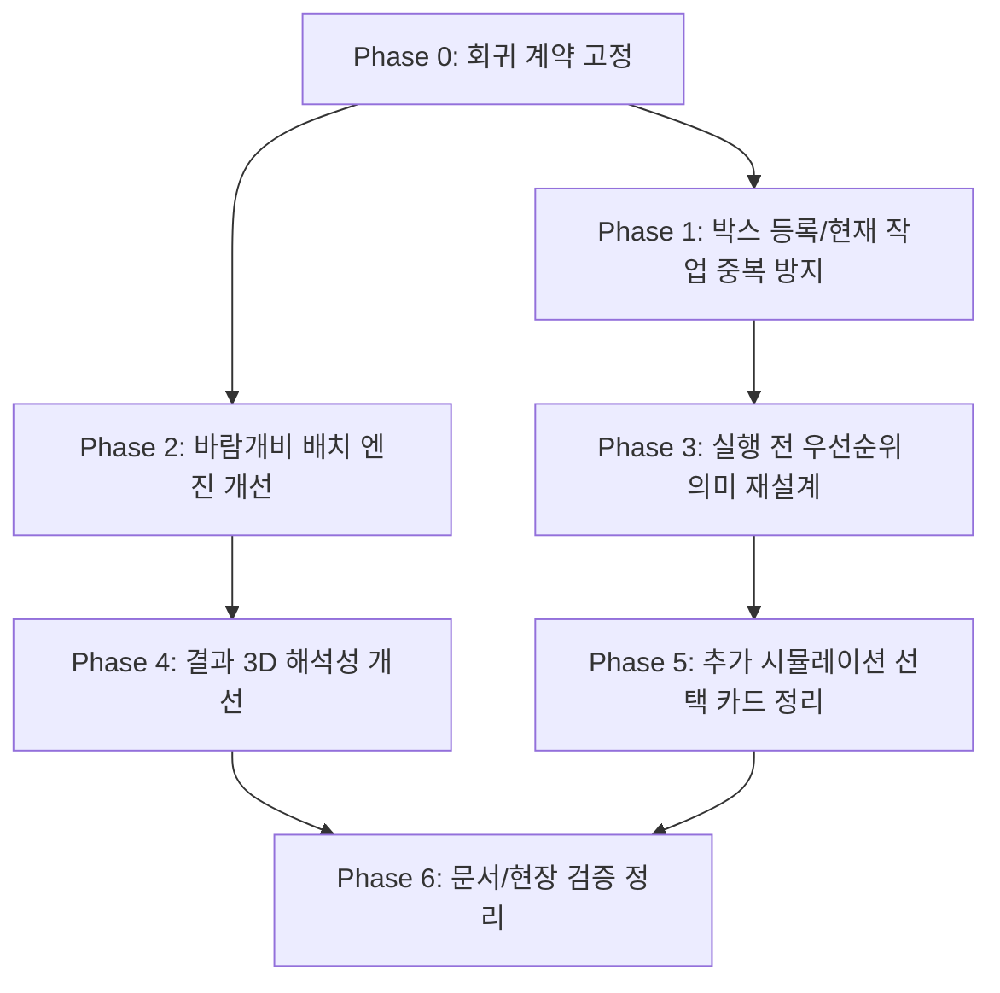

# Package Tetris V2 Field Patch Plan

> **For agentic workers:** REQUIRED PROCESS: product-manager must consult business-analyst, ui-designer, ui-ux-tester, code-reviewer, and nextjs-developer before visible UI changes. Implementation must happen on `v2`, not `main`, until this patch scope is stable.

**Goal:** 2026-06-12 현장 피드백을 V2 후속 안정화 패치로 분리하고, 입력 오류 방지, 결과 해석성, 추가 시뮬레이션 선택성, 바람개비 배치 엔진 정합성을 단계적으로 해결한다.

**Architecture:** 프론트 단독 Next.js 구조를 유지한다. 입력/저장 무결성은 `src/lib/workspace/block-library.ts` 같은 순수 유틸에서 먼저 고정하고, 화면은 그 계약을 호출한다. 엔진 변경은 `packing-placement` 후보 좌표 생성과 `packing-engine` 회귀 테스트를 먼저 고정한 뒤 `chain-simulation`, `multi-chain-simulation`, `field:audit`까지 같은 안전 검증을 통과해야 한다.

**Tech Stack:** Next.js App Router, React client components, TypeScript, Three.js, IndexedDB workspace persistence, JSON backup, Node test runner, `.xlsx` import.

---

## 1. PM Decision Summary

### 1.1 검토한 3가지 접근

1. **전체 피드백 일괄 패치**
   - 장점: 한 번에 체감 변화가 크다.
   - 단점: UI, 데이터 무결성, 엔진 탐색 전략이 한 커밋에 섞여 회귀 원인 추적이 어렵다.
   - 판단: 채택하지 않는다.

2. **UI 쉬운 항목 선반영 후 엔진 수정**
   - 장점: 빠르게 화면 피드백을 줄일 수 있다.
   - 단점: 현장 신뢰를 가장 크게 떨어뜨린 `690 x 370 x 580mm` 8개 케이스가 뒤로 밀린다.
   - 판단: 채택하지 않는다.

3. **계약 고정 우선, 입력/결과/엔진 분리 패치**
   - 장점: 실패 케이스를 먼저 테스트로 고정하고 각 패치의 영향을 좁힐 수 있다.
   - 단점: 첫 체감 개선까지 단계가 하나 더 필요하다.
   - 판단: 채택한다.

### 1.2 PM 기본 결정안

- `690 x 370 x 580mm` 8개가 `기본 파레트 1100 x 1100 x 1550mm`에 1파레트로 들어간다는 현장 피드백은 V2 패치 목표로 채택한다.
- 이 패턴은 내부 문서와 테스트에서는 `바람개비 배치(pinwheel)`로 부른다. 사용자 UI에서는 필요한 경우 `엇갈림 배치`처럼 설명형 문구를 함께 쓴다.
- 박스 등록 치수 피드백은 `숫자 기본값 제거`와 `예시 숫자 placeholder 미사용`으로 정규화한다.
- 박스명 중복은 화면만이 아니라 저장 유틸 계약에서 막는다.
- 현재 작업 대상 박스 중복은 새 카드를 계속 만들지 않는다. 기본 동작은 기존 카드 수량에 합치고, 현장 사용자가 이해할 수 있는 상태 문구를 보여준다.
- `먼저 바닥에`와 `맨 아래 우선`은 같은 의미로 보이므로 중복을 제거한다. 기본 패치는 `기본 / 아래 우선` 2단계로 정리하고, `위로 배치 선호`는 실제 엔진 정책까지 함께 구현하는 별도 승인안으로 둔다.
- 3D 캔버스 클릭으로 박스 강조가 켜지는 동작은 제거한다. 박스 식별은 범례, hover tooltip, 2D 보기 중심으로 유지한다.
- 3D 오버레이는 공간 원래 치수 대신 선택된 결과 공간의 실제 적재 최대 치수인 `결과 최대치수`를 표시한다.
- 이 문서는 2026-06-12 현장 패치의 기준 작업 지시서다. 모든 구현은 `v2`에서 진행하고, 안정화 전에는 `main`에 직접 반영하지 않는다.
- 신규 박스 치수 입력은 숫자 기본값과 예시 숫자 placeholder를 모두 제거한다. 단위와 입력 목적은 라벨, suffix, 오류 문구로만 전달한다.
- 현재 작업에 동일 박스를 다시 선택하면 기존 카드 수량만 합산한다. 배치 우선, 깨짐주의, 회전 가능 같은 기존 카드 설정은 유지하고, 다른 설정이 필요하면 사용자가 해당 카드에서 직접 수정한다.
- `690 x 370 x 580mm` 엔진 완료 조건은 `1공간 / 8개 / 미적재 0 / invariant 통과`를 1차 기준으로 둔다. 좌표 signature는 대표 회귀 기준이지만, 같은 안전 조건을 만족하는 다른 유효 배치가 나올 경우 PM과 code-reviewer 확인 후 기준 signature를 갱신할 수 있다.
- 패치 완료 보고에는 자동 검증 결과와 현장 대표 케이스 재현 로그를 `docs/verification/` 아래에 남긴다.

### 1.3 Field Feedback Coverage Check

| 원문 피드백 | 계획 반영 위치 | 완료 기준 | 누락/보강 판단 |
| --- | --- | --- | --- |
| 박스 등록 가로/세로/높이 입력의 기본 문구 또는 기본값 제거 | Phase 1 | 신규 박스 등록 치수 입력이 빈 값으로 시작하고, 예시 숫자 placeholder 없이 라벨/단위/오류 문구로만 의미를 전달한다. | 반영됨 |
| 신규 박스명이 기존 박스명과 같으면 중복 등록 방지 | Phase 1 | 수동 저장, 수정 저장, 저장 박스 `.xlsx` import가 같은 정규화 기준으로 중복명을 막는다. | 반영됨 |
| `먼저 바닥에`와 `맨 아래 우선` 중복 제거 | Phase 3 | 같은 동작을 하는 두 버튼이 동시에 보이지 않고, 기존 데이터는 `아래 우선`으로 보정된다. | 반영됨 |
| `웬만하면 맨위로` 같은 상단 선호 가능성 검토 | Phase 3, Tracking Risks | 단순 문구 변경으로 노출하지 않는다. 실제 엔진 정책을 구현할 때만 `위로 배치 선호`로 별도 승인 후 확장한다. | 보류 사유 명시 |
| 실제 작업 대상 박스 중복 선택 방지 | Phase 1 | 같은 저장 박스를 다시 추가하면 새 카드가 생기지 않고 기존 카드 수량에 합산된다. | 반영됨 |
| 3D 방향 화살표를 선분보다 면형 화살표로 개선 | Phase 4 | `THREE.ArrowHelper` 대신 얇은 mesh/shape 기반 화살표를 렌더링하고, raycast 대상에서 제외한다. | 반영됨 |
| 3D 상단 공간 치수 대신 실제 결과 최대 가로/세로/높이 표시 | Phase 4 | 선택 공간에서 박스가 도달한 끝 좌표 기준 최대값을 `결과 최대치수`로 표시한다. | 반영됨 |
| 3D 회전 후 클릭을 놓을 때 박스 강조가 켜지는 동작 제거 | Phase 4, Required Verification | 캔버스 클릭이 선택 상태를 만들지 않으며, 브라우저에서 pointer up/click 회귀를 확인한다. | 반영됨 |
| 추가 박스 시뮬레이션 선택 카드 우측 상단에 선택 취소 버튼 추가 | Phase 5 | 선택 카드별 48px 삭제 버튼으로 선택 해제, 순위 재정렬, preview stale 처리를 수행한다. | 반영됨 |
| `690 x 370 x 580mm` 8개 기본 파레트 1공간 적재 | Phase 0, Phase 2, Phase 5.1 | 실패 테스트를 먼저 고정하고, 구현 후 `usedSpaceCount=1`, `packedBlockCount=8`, invariant, `field:audit`를 통과한다. | 반영됨 |
| 엔진 정합성 검사와 회귀 테스트를 확실히 매듭 | Phase 5.1, Required Verification | boundary, collision, support, fragile, partial support, determinism, utilization, 추가 시뮬레이션 variant invariant를 모두 검증한다. | 보강됨 |

## 2. Role Reports

### 2.1 Business Analyst

- 이번 피드백은 단순 UI 수정이 아니라 `용어`, `입력 제약`, `결과 해석`, `엔진 정합성`이 섞인 패치다.
- `먼저 바닥에`와 `맨 아래 우선`은 현장 언어상 중복이다.
- `가능하면 위로`는 copy 변경이 아니라 실제 배치 정책 변경이다.
- `690 x 370 x 580mm` 8개 케이스는 현장 승인 회귀 케이스로 별도 고정해야 한다.

### 2.2 UI Designer

- 박스 등록 입력은 빈 치수 입력 상태에서 시작하고, 저장 가능/불가능 상태를 버튼과 짧은 안내로 보여준다.
- 우선순위 버튼은 중복 의미를 제거한다. 릴리즈 안전안은 `기본`, `아래 우선` 2단계다.
- `위로 배치 선호`는 실제 엔진 정책이 구현될 때만 노출한다. 라벨만 바꾸면 현장 오해가 커진다.
- 결과 3D의 숫자 오버레이는 `가로 / 세로 / 높이` compact chip bar로 표시하고 라벨을 `결과 최대치수`로 명확히 바꾼다.
- 추가 시뮬레이션 선택 카드는 우측 상단에 48px 터치 가능한 `X` 또는 삭제 아이콘을 둔다. 순위 이동 버튼과 겹치지 않게 우측 액션 컬럼을 유지한다.

### 2.3 UI/UX Tester

- 360px, 390px, 768px, 1280px에서 치수 입력 행, 현재 작업 카드, 추가 시뮬레이션 선택 카드, 3D 오버레이가 가로 넘침을 만들면 실패로 본다.
- UI 변경 후에는 source-level layout test만으로 끝내지 않고 브라우저에서 주요 CTA와 카드 bounding box를 확인한다.
- 3D 클릭 강조 제거 후에도 hover tooltip과 범례로 박스 종류를 확인할 수 있어야 한다.
- `위로 배치 선호`를 승인해 구현하는 경우 버튼명만으로 의미가 부족할 수 있으므로 실행 전 확인 요약에 적용된 박스 수와 설명을 보여준다.
- 현재 추가 시뮬레이션의 선택 순서 기반 UI에서는 기존 `먼저추가/최우선추가` 버튼 중복 문제가 재현되지 않는다. 이번 패치의 우선순위 버튼 중복 이슈는 주로 3번 실행 전 확인의 현재 작업 카드에 남아 있는 `먼저 바닥에`와 `맨 아래 우선`을 대상으로 본다.
- 자동 테스트는 통과해도 실제 브라우저에서 3D 클릭, 선택 카드 해제 동선, 다운로드/업로드 side effect는 별도로 확인해야 한다.

### 2.4 Next.js Developer

- 서버 기능은 추가하지 않는다. 모든 작업은 기존 client component, 순수 유틸, worker 계산 경로 안에서 처리한다.
- `박스명 중복 방지`는 `tetris-workspace-app.tsx` handler만이 아니라 `block-library.ts`에 공통 정책으로 두는 것이 안전하다.
- `작업 대상 중복 방지`는 `addBlockTemplateToDraft` 정책을 바꾸는 작업이며 수량 합산, 우선순위 충돌, undo 문구를 함께 정의해야 한다.
- `위로 배치 선호`는 기존 `loadPriority` 점수만으로는 의미가 애매하므로, 구현하려면 migration과 정렬 규칙을 같이 다뤄야 한다.
- `690 x 370 x 580mm`는 greedy first-fit의 탐색 후보 부족 이슈다. 일반 exact solver가 아니라 dimension-aware 후보 좌표를 먼저 늘리는 작은 휴리스틱이 적절하다.

### 2.5 Code Reviewer

- `690 x 370 x 580mm` 케이스는 `usedSpaceCount`, 블록 수, 좌표/회전 서명을 회귀 테스트로 고정해야 한다.
- 추가 시뮬레이션은 `custom-priority`만 검증하지 말고 `recommended`, `custom-priority`, 각 `template-priority` variant 전체를 안전 검증해야 한다.
- 엔진 패치 후에는 경계 초과, 충돌, 공중 배치, 지지면, 깨짐주의 정책을 모두 다시 검증한다.
- 무거운 현장 회귀 테스트는 `field:audit`에 포함하되, 빠른 단위 테스트와 역할을 구분한다.

## 3. External Research Notes

- 물류/트럭 적재에서 pinwheel 또는 pinwheeling은 직사각형 화물을 서로 다른 방향으로 번갈아 놓아 공간 활용을 높이는 배치 방식으로 쓰인다. 참고: [Hale Trailer - Pinwheel Pallet Loading](https://haletrailer.com/blog/pinwheel-pallet-loading/).
- 물류 안전 원칙은 공간 효율만으로 끝나지 않는다. OSHA는 계단식으로 쌓인 자재가 미끄러짐, 낙하, 붕괴를 막도록 안정적으로 쌓이거나 고정되어야 한다고 설명한다. 참고: [OSHA 1926.250](https://www.osha.gov/laws-regs/regulations/standardnumber/1926/1926.250), [OSHA 1910.176](https://www.osha.gov/laws-regs/regulations/standardnumber/1910/1910.176).

## 4. Workstreams And Order



## 5. Phase 0. Regression Contract First

**Goal:** 구현 전에 현장 피드백을 테스트 계약으로 고정한다.

**Files:**
- Modify: `src/lib/workspace/packing-engine.test.ts`
- Modify: `src/lib/workspace/packing-field-scenarios.ts`
- Modify: `src/lib/workspace/packing-field-scenarios.test.ts`
- Modify: `src/lib/workspace/multi-chain-simulation.test.ts`
- Create: `src/lib/workspace/packed-space-signature.ts`
- Create: `src/lib/workspace/packed-space-signature.test.ts`

**Steps:**
1. `packed-space-signature.ts`를 추가해 `PackedSpace`의 블록을 `zMm`, `yMm`, `xMm`, `rotation`, `widthMm`, `depthMm`, `heightMm` 순으로 정렬한 문자열 signature로 만든다.
2. `690 x 370 x 580mm` 8개 기본 파레트 케이스가 현재 2공간을 반환한다는 실패 테스트를 먼저 작성한다.
3. 대표 signature는 한 레이어에 4개, 총 2레이어다. 이 signature는 회귀 분석과 deterministic 비교를 위한 기준이며, 제품 완료 조건은 1공간 적재와 invariant 통과다.

```text
z=0:
- x=0,   y=0,   w=690, d=370, h=580, rotation=xyz
- x=690, y=0,   w=370, d=690, h=580, rotation=yxz
- x=0,   y=370, w=370, d=690, h=580, rotation=yxz
- x=410, y=690, w=690, d=370, h=580, rotation=xyz

z=580:
- 위 4개와 같은 x/y/w/d/rotation, z만 580
```

4. 해당 결과가 `usedSpaceCount=1`, `blocks.length=8`, `unloadedBlockCount=0`을 만족해야 한다.
5. 모든 결과 공간에 대해 기존 안전 검증을 실행한다.
6. 추가 시뮬레이션 variant 전체를 검증하도록 `field:audit` 보강 계획을 테스트에 남긴다.

**Acceptance Criteria:**
- 현재 엔진에서 `690 x 370 x 580mm` 8개 케이스가 실패하는 테스트가 먼저 생긴다.
- 구현 후 해당 케이스는 `usedSpaceCount=1`, `blocks.length=8`, `unloadedBlockCount=0`을 만족한다.
- 목표 배치는 공간 경계, 충돌, 지지면, 깨짐주의 정책을 모두 통과해야 한다.
- 좌표 signature는 대표 회귀 기준으로 검증하되, 같은 안전 조건을 만족하는 다른 deterministic 배치가 나온 경우 테스트 expectation을 갱신하기 전에 PM과 code-reviewer가 배치 근거를 기록한다.

### 5.1 Engine Correctness Closure Gate

이 이슈는 단일 fixture 수정으로 닫지 않는다. 적재 엔진은 아래 정합성 gate를 모두 통과해야 Phase 2 구현을 완료한 것으로 본다.

**Files:**
- Create: `src/lib/workspace/packing-engine-invariants.ts`
- Create: `src/lib/workspace/packing-engine-invariants.test.ts`
- Create: `src/lib/workspace/packing-engine-field-regression.test.ts`
- Modify: `src/lib/workspace/packing-engine.test.ts`
- Modify: `src/lib/workspace/packing-placement.test.ts`
- Modify: `src/lib/workspace/packing-field-scenarios.ts`
- Modify: `src/lib/workspace/field-audit-report.test.ts`

**Invariant checks:**
- 모든 `PackedBlock`은 `calculateUsableSize(space)` 내부에 있어야 한다.
- 어떤 두 박스도 3D 충돌하면 안 된다.
- `zMm > 0`인 박스는 현재 policy 기준의 하단 지지면을 가져야 한다.
- 부분 지지 OFF에서는 100% 지지면을 요구하고, ON에서는 `minimumSupportRatio` 이상만 허용한다.
- 깨짐주의 정책은 부분 지지 ON/OFF와 무관하게 유지된다.
- 입력 수량 총합은 `packed block count + unloadedBlockCount`와 일치해야 한다.
- `blockId`는 결과 안에서 중복되면 안 된다.
- `usedSpaceCount`는 실제 `spaces.length`와 같아야 한다.
- `utilizationRate`와 `averageUtilizationRate`는 적재 부피 기준으로 재계산했을 때 허용 오차 안에 있어야 한다.
- 같은 입력은 항상 같은 좌표와 회전 signature를 반환해야 한다.

**Regression fixture matrix:**
- `690 x 370 x 580mm`, 기본 파레트, 수량 8, 부분 지지 OFF, 기대 `1공간 / 8개`.
- 위 케이스의 치수 순서 permutation: `370 x 690 x 580mm`, `580 x 370 x 690mm`, `690 x 580 x 370mm`.
- 경계 근접 케이스: `690 x 370 x 580mm` 수량 9는 1공간에 9개가 들어가면 안 되며, 안전하게 2공간 또는 미적재로 처리되어야 한다.
- off-by-one 케이스: `691 x 370 x 580mm`, `690 x 371 x 580mm`, `690 x 370 x 581mm`는 같은 기대값을 그대로 복사하지 말고 결과가 안전 검증을 통과하는지만 본다.
- 기존 혼합 현장 케이스: `1000 x 800 x 400mm`, `965 x 300 x 200mm`, `600 x 250 x 150mm` 추가 시뮬레이션은 모든 variant를 검증한다.
- 부분 지지 55% 케이스는 이번 후보 확장 후에도 OFF/ON 결과 차이를 유지해야 한다.
- 깨짐주의 케이스는 일반 박스가 깨짐주의 박스 위에 올라가지 않는 기존 정책을 유지해야 한다.

**Field audit rule:**
- `npm run field:audit`는 `현장 바람개비 적재 검증` 기능 검증을 추가한다.
- `field:audit` summary에는 아래 기능 검증 이름과 `usedSpaceCount`, `packedBlockCount`, `unloadedBlockCount`, invariant 통과 여부가 반드시 표시되어야 한다.
  - `현장 바람개비 적재 검증 - 기본 8개`
  - `현장 바람개비 적재 검증 - 치수 순서 변형`
  - `현장 바람개비 적재 검증 - 9개 경계`
  - `현장 바람개비 적재 검증 - 주변 치수`
  - `현장 바람개비 적재 검증 - 혼합 추가 시뮬레이션 결과`
- `field:audit`만 녹색이어도 위 항목 중 하나가 summary에서 빠지면 엔진 패치 완료로 보지 않는다.

## 6. Phase 1. Box Registration And Current Work Integrity

**Goal:** 저장 박스와 현재 작업 박스가 중복으로 늘어나는 문제를 막고, 치수 기본값으로 인한 오입력을 줄인다.

**Files:**
- Modify: `src/lib/workspace/block-library.ts`
- Modify: `src/lib/workspace/block-library.test.ts`
- Modify: `src/lib/workspace/field-number-input.ts`
- Modify: `src/lib/workspace/field-number-input.test.ts`
- Modify: `src/lib/workspace/field-number-input-layout.test.ts`
- Modify: `src/lib/workspace/block-template-xlsx-import.ts`
- Modify: `src/lib/workspace/block-template-xlsx-import.test.ts`
- Modify: `src/lib/workspace/draft-block-xlsx-import.ts`
- Modify: `src/lib/workspace/draft-block-xlsx-import.test.ts`
- Modify: `src/lib/workspace/result-freshness.ts`
- Modify: `src/lib/workspace/result-freshness.test.ts`
- Modify: `src/components/tetris-workspace-app.tsx`
- Modify: `src/lib/workspace/block-library-search-layout.test.ts`
- Modify: `src/lib/workspace/draft-block-xlsx-import-layout.test.ts`

**Implementation Direction:**
- `normalizeBlockTemplateNameKey(name)`을 공통 유틸로 승격한다.
- 수동 신규 저장은 같은 정규화 박스명이 있으면 저장하지 않고 오류 문구를 표시한다.
- 박스명 중복 오류는 박스명 필드 아래 inline error와 저장 버튼 근처 error summary에 함께 보여준다.
- 수정 저장은 자기 자신을 제외하고 같은 이름이 있으면 막는다.
- 빈 이름을 `신규 박스`로 자동 치환하지 않는다. 박스명은 필수로 둔다.
- 박스 치수 form state는 `number | ""`를 허용하고 신규 등록 기본값은 빈 값으로 둔다.
- `number | ""`는 React form local state와 `NumberFieldInput` 계약 안에서만 허용한다. `BlockTemplate`, IndexedDB, JSON backup, import/export, packing input에는 빈 문자열을 흘리지 않는다.
- 치수 입력에는 예시 숫자 placeholder를 넣지 않는다. 첫 진입은 오류 없는 중립 상태이고, blur 또는 저장 시도 후 필드명 포함 오류를 표시한다.
- 저장 버튼은 박스명, 가로, 세로, 높이가 모두 유효할 때만 활성화한다.
- 저장 시도 후 오류가 있으면 첫 오류 필드로 focus를 이동한다.
- 현재 작업에 같은 `blockTemplateId`를 추가하면 새 카드 대신 기존 카드 수량에 합친다.
- 수량 합산 시 기존 `loadPriority`를 유지하고, 합산 사실을 status 문구로 보여준다.
- 수량 합산은 undo, result freshness fingerprint, JSON backup/restore 결과까지 같은 의미를 유지해야 한다.
- 현재 작업 중복 추가 status는 해당 카드 근처에 `기존 카드에 {수량}개 합산됨`처럼 표시한다.
- 현재 작업 `.xlsx` import에서 같은 박스명이 여러 행에 있으면 행 단위 오류 대신 수량 합산 미리보기를 보여준다. 잘못된 수량은 기존처럼 오류 행으로 남긴다.
- `.xlsx` 합산 미리보기는 합산 전 수량, 추가 수량, 합산 후 수량을 표에 표시한다.
- `.xlsx` 중복 행끼리 `적재위치타입`이 다르면 수량은 합산하되 기존 카드 정책을 유지하고, preview에 `기존 설정 유지` 경고를 표시한다.

**Acceptance Criteria:**
- 신규 박스 등록의 가로/세로/높이는 빈 입력으로 시작한다.
- 신규 박스 등록의 가로/세로/높이는 예시 숫자 placeholder를 보여주지 않는다.
- 중복 박스명은 수동 저장, 수정 저장, 저장 박스 `.xlsx` import 모두에서 같은 기준으로 막힌다.
- 중복 박스명 오류는 사용자가 수정해야 할 필드와 해결 행동을 한 화면에서 알 수 있다.
- 현재 작업에 같은 박스를 다시 추가해도 카드가 늘어나지 않는다.
- 중복 추가는 수량 합산 또는 명확한 안내로 처리된다.
- 수량 합산 시 기존 카드의 배치 우선, 깨짐주의, 회전 가능 설정은 유지된다.
- 기존 백업/IndexedDB에서 숫자 치수는 그대로 로드된다.

## 7. Phase 2. Pinwheel Placement Engine Patch

**Goal:** 동일 박스 반복 적재에서 바람개비형 엇갈림 배치를 탐색해 현장 케이스를 1파레트로 계산한다.

**Files:**
- Modify: `src/lib/workspace/packing-placement.ts`
- Modify: `src/lib/workspace/packing-placement.test.ts`
- Modify: `src/lib/workspace/packing-engine.ts`
- Modify: `src/lib/workspace/packing-engine.test.ts`
- Modify: `src/lib/workspace/packing-output-safety.test.ts`
- Modify: `src/lib/workspace/packed-result-validation.test.ts`
- Modify: `src/lib/workspace/chain-simulation.test.ts`
- Modify: `src/lib/workspace/multi-chain-simulation.test.ts`
- Modify: `src/lib/workspace/packing-field-scenarios.ts`

**Implementation Direction:**
- full backtracking이나 외부 solver는 도입하지 않는다.
- `findFirstStablePlacement`의 후보 좌표를 rotation별 dimension-aware 방식으로 확장한다.
- 각 축 후보에 아래 값을 포함한다.

```ts
[
  0,
  usableAxisSize - candidateAxisSize,
  ...blocks.map((block) => blockStart),
  ...blocks.map((block) => blockEnd),
  ...blocks.map((block) => blockStart - candidateAxisSize),
  ...blocks.map((block) => blockEnd - candidateAxisSize)
]
```

- 후보 좌표는 `0 <= value <= usableAxisSize - candidateAxisSize` 범위만 남긴다.
- 정렬은 기존처럼 낮은 `z`, 낮은 `y`, 낮은 `x`를 우선하되, 동일 높이에서 남는 공간을 줄이는 tie-breaker를 추가할지 테스트 결과를 보고 결정한다.
- Phase 0 signature가 통과해야 한다.
- 추가 시뮬레이션도 같은 엔진을 사용하므로 별도 로직 복사는 하지 않는다.
- 후보 생성 변경은 `packing-placement` 단위 테스트에서 먼저 검증한다. 특히 `usableAxisSize - candidateAxisSize`, `blockStart - candidateAxisSize`, `blockEnd - candidateAxisSize` 후보가 바람개비 배치에 필요한 좌표를 만드는지 확인한다.
- 엔진은 greedy를 유지하되, 후보 수 증가로 인해 잘못된 첫 후보를 고르지 않도록 `candidate ranking`을 테스트로 고정한다.
- `ensureSafeOptimizationOutput` 또는 invariant gate가 실패하면 결과를 성공으로 반환하지 않는다.
- 추가 시뮬레이션은 base result locked 상태에서 같은 invariant gate를 variant별로 실행한다.
- 엔진 수정 후 `690 x 370 x 580mm` 케이스가 UI에서는 1파레트로 보이더라도, 내부 invariant 중 하나라도 실패하면 작업 완료로 보지 않는다.

**Acceptance Criteria:**
- `690 x 370 x 580mm` 8개 기본 파레트 케이스는 1공간에 8개가 모두 적재된다.
- 기존 현장 audit 6개 기능 검증은 그대로 통과한다.
- 부분 지지 OFF/ON, 깨짐주의 정책, 경계/충돌 검증이 유지된다.
- 계산 시간이 현장 audit 기준에서 급격히 증가하지 않는다.
- `packing-engine-field-regression.test.ts`는 현장 바람개비 케이스와 주변 치수 회귀 케이스를 별도 suite로 보관한다.
- `multi-chain-simulation.test.ts`는 `recommended`, `custom-priority`, 모든 `template-priority` variant에 invariant gate를 적용한다.
- `field:audit`는 기존 6개 기능 검증에서 7개 이상으로 늘어나고, 새 `현장 바람개비 적재 검증`을 포함한다.
- `npm run v2:verify`를 통과하기 전에는 이 엔진 이슈를 완료로 보고하지 않는다.

## 8. Phase 3. Loading Preference Redesign

**Goal:** `먼저 바닥에`와 `맨 아래 우선` 중복을 없애고, 현장 사용자가 이해할 수 있는 배치 우선 설정으로 정리한다.

**Files:**
- Modify: `src/lib/workspace/types.ts`
- Modify: `src/lib/workspace/load-priority.ts`
- Modify: `src/lib/workspace/block-library.ts`
- Modify: `src/lib/workspace/workspace-migration.ts`
- Modify: `src/lib/workspace/result-freshness.test.ts`
- Modify: `src/lib/workspace/draft-block-xlsx-import.ts`
- Modify: `src/lib/workspace/draft-block-xlsx-import.test.ts`
- Modify: `src/components/tetris-workspace-app.tsx`
- Modify: `src/lib/workspace/draft-block-priority-layout.test.ts`
- Modify: `docs/field-demo-user-guide.md`
- Modify: `docs/development-deliverables.md`

**Implementation Direction:**
- 이번 패치 기본안은 `기본`, `아래 우선` 2단계다.
- `아래층 우선` 섹션 라벨은 `배치 우선`으로 바꿔 추후 상단 선호 확장을 막지 않는다.
- 기존 `먼저 바닥에`, `맨 아래 우선`은 모두 `아래 우선`으로 보정한다.
- `위로 배치 선호`는 별도 사용자 승인 후 확장한다. 승인되면 내부 모델은 숫자 우선순위만 계속 쓰지 않고 `placementPreference` enum으로 확장한다.

```ts
type PlacementPreference = "normal" | "floor-first" | "top-preferred";
```

- 2단계 기본안에서는 기존 numeric `loadPriority`를 유지하되, 5와 10을 모두 같은 `아래 우선` 라벨로 표시한다.
- `위로 배치 선호` 승인안에서는 migration이 기존 `loadPriority` 5와 10을 모두 `"floor-first"`로 보정하고, 엔진 정렬은 `"floor-first"`를 먼저 배치하며 `"top-preferred"`는 같은 조건에서 늦게 배치한다.
- `.xlsx` 현재 작업 포맷은 새 컬럼명 `적재위치타입`으로 전환한다.
- 호환성 때문에 기존 `아래층우선타입` 컬럼은 계속 읽되, 문서와 샘플은 `적재위치타입`만 안내한다.
- 2단계 기본안은 `1=기본`, `2=아래우선`을 안내한다.
- `위로 배치 선호` 승인안은 `1=기본`, `2=아래우선`, `3=위로배치선호`를 안내한다.
- 실행 전 확인 요약은 `아래 우선`으로 지정된 박스명, 수량, 적용 정책을 표시한다.
- `아래 우선` 지정이 0개이면 `모두 기본 배치` 상태 문구를 표시하고 별도 경고로 보지 않는다.
- `위로 배치 선호`는 PM 승인, 엔진 정렬 정책, import enum, 실행 전 요약, 사용자 가이드가 모두 같은 cycle에서 준비될 때만 노출한다.

**Acceptance Criteria:**
- 같은 동작을 하는 두 버튼이 동시에 보이지 않는다.
- 기존 작업본의 `먼저 바닥에`/`맨 아래 우선` 설정은 `아래 우선`으로 안전하게 보정된다.
- 2단계 기본안에서는 실행 전 확인 요약이 `아래 우선` 지정 수를 보여준다.
- 실행 전 확인 요약은 `아래 우선` 지정 수만이 아니라 박스명과 수량을 함께 보여준다.
- `위로 배치 선호` 승인안에서는 `위로 배치 선호`로 지정한 박스가 가능한 조건에서 다른 일반 박스보다 늦게 배치되는 테스트가 있다.

## 9. Phase 4. Result 3D Interpretation Patch

**Goal:** 결과 화면에서 실제 적재 크기와 방향을 더 직관적으로 확인하게 하고, 의도치 않은 클릭 강조를 제거한다.

**Files:**
- Modify: `src/lib/workspace/packing-scene.ts`
- Modify: `src/lib/workspace/packing-scene.test.ts`
- Modify: `src/components/result-stage/result-3d-canvas.client.tsx`
- Modify: `src/lib/workspace/result-3d-dimension-overlay-layout.test.ts`
- Modify: `src/lib/workspace/result-3d-orientation-arrow-layout.test.ts`
- Modify: `src/lib/workspace/result-selection-clear-action-layout.test.ts`
- Modify: `src/app/globals.css`

**Implementation Direction:**
- `calculatePackedBlocksFootprint(blocks)`를 추가한다.
- 선택된 결과 공간에서 각 블록의 끝 좌표 `max(x + width)`, `max(y + depth)`, `max(z + height)`를 `결과 최대치수`로 표시한다.
- 블록이 없으면 `0 / 0 / 0mm`를 표시한다.
- 기존 `3D 공간 치수` aria-label은 `3D 결과 최대치수`로 바꾼다.
- `결과 최대치수`는 현재 선택된 결과 공간 1건이 공간 원점 기준으로 실제 도달한 최대 치수(mm)다. 원래 공간 치수는 공간 선택/공간 목록 쪽에서 계속 확인 가능하게 유지한다.
- 3D 캔버스 클릭으로 `onSelectBlockTemplate`을 호출하지 않는다.
- 범례 또는 2D 보기에서의 식별 경로는 유지한다.
- 범례로 선택한 강조 상태를 풀 수 있도록 `강조 해제` 버튼과 `Esc` 해제 경로는 유지한다.
- 모바일/태블릿에서는 hover tooltip을 핵심 식별 수단으로 보지 않는다. 범례와 2D 보기만으로 박스 종류를 확인할 수 있어야 한다.
- 3D는 회전/검토 전용으로 정리하되, 범례로 선택된 강조 상태를 3D 포커스에서도 해제할 수 있게 키보드 도움말의 `Esc 강조 해제` 계약은 유지한다.
- 방향 화살표는 `THREE.ArrowHelper` 선분 대신 `THREE.ShapeGeometry` 또는 얇은 `THREE.Mesh` 기반의 납작한 면형 화살표로 교체한다.
- 화살표는 블록 raycast 대상에 포함하지 않는다.
- 화살표 mesh는 작은 박스에서도 보이도록 shaft와 head의 최소 크기를 가진다. 구현 시 `min(블록 짧은 축의 35%)`를 넘지 않게 하고, 화면상 뭉개지면 layout test 또는 screenshot 검증에서 실패로 본다.
- 위/앞/옆/자유시점 전환과 크게 보기에서도 화살표가 박스 밖으로 과도하게 삐져나오거나 잘리지 않아야 한다.

**Acceptance Criteria:**
- 3D를 회전하다 클릭을 놓아도 박스 강조 상태가 생기지 않는다.
- 3D 오버레이는 공간 치수가 아니라 실제 결과 최대치수를 보여준다.
- 방향 화살표는 선분보다 면적으로 보이고, 입력 높이 방향 의미는 유지한다.
- 모바일/태블릿에서 범례와 2D 보기만으로 박스 식별이 가능하다.
- hover tooltip은 데스크톱 보조 기능으로만 남는다.
- 3D 캔버스 클릭은 선택을 바꾸지 않고, 범례 선택/강조 해제만 강조 상태를 바꾼다.
- WebGL fallback 문구는 유지된다.

## 10. Phase 5. Additional Simulation Selection UX

**Goal:** 추가 박스 시뮬레이션에서 선택한 박스를 빠르게 취소하고, 선택 순위와 수량 조건을 이해하기 쉽게 유지한다.

**Files:**
- Modify: `src/components/tetris-workspace-app.tsx`
- Modify: `src/lib/workspace/multi-chain-simulation-layout.test.ts`
- Modify: `src/lib/workspace/chain-simulation-requested-quantity-layout.test.ts`
- Modify: `src/app/globals.css`

**Implementation Direction:**
- 선택된 추가 박스 순위 카드 우측 상단에 삭제 버튼을 둔다.
- 삭제 버튼은 `aria-label="{박스명} 추가 시뮬레이션 선택 해제"`를 사용한다.
- 삭제 버튼은 X 아이콘과 `해제` 텍스트를 함께 사용한다. 360px에서도 의미가 보이지 않으면 X만 남기지 않는다.
- 삭제 시 선택 순서, 지정 수량, preview 결과를 함께 갱신한다.
- 삭제 후 preview는 자동 재계산하지 않고 `조건이 바뀌었습니다. 다시 계산하세요.` 상태로 명확히 표시한다.
- 삭제 후 focus는 다음 선택 카드의 삭제 버튼으로 이동하고, 다음 카드가 없으면 `저장된 박스 찾아 선택` 버튼으로 이동한다.
- 삭제 후 live status로 `{박스명} 선택을 해제했습니다.`를 알린다.
- 3개 카드가 모두 있을 때도 카드 높이가 과도하게 커지지 않도록 우측 액션 컬럼 안에 배치한다.
- 삭제 버튼 hit area는 최소 48px이고, 순위 이동 버튼과 최소 8px 이상 떨어져야 한다.
- 360px에서는 삭제 버튼이 카드 제목 줄 오른쪽에 남고, 순위 이동 버튼은 다음 줄에서 2열 이하로 접는다.
- 같은 박스가 이미 선택되어 있으면 검색/목록에서 다시 선택할 수 없게 하거나 `이미 선택됨` 상태로 표시한다. 삭제 후에는 다시 선택 가능해야 한다.

**Acceptance Criteria:**
- 선택한 추가 박스를 한 번에 해제할 수 있다.
- 삭제 후 남은 카드 순위가 1부터 다시 정렬된다.
- 추가 결과 preview는 삭제 후 stale 상태가 되거나 자동 재계산 기준이 명확히 표시된다.
- 같은 추가 박스를 중복 선택할 수 없다.
- 삭제 후 재선택해도 지정 수량과 순위가 새 선택 기준으로 초기화된다.
- 360px, 390px, 768px, 1280px에서 카드가 가로 넘치지 않는다.

## 11. Phase 6. Documentation And Verification

**Goal:** 구현 상태와 현장 가이드를 일치시키고, 다음 PM 사이클에서 같은 기준으로 검증한다.

**Files:**
- Modify: `docs/plans/2026-06-10-v2-field-feedback-roadmap.md`
- Modify: `docs/field-demo-user-guide.md`
- Modify: `docs/development-deliverables.md`
- Modify: `src/lib/workspace/v2-roadmap-document.test.ts`
- Modify: `src/lib/workspace/field-demo-user-guide-document.test.ts`
- Modify: `src/lib/workspace/development-deliverables-document.test.ts`

**Acceptance Criteria:**
- 문서에는 `맨 아래 우선`을 새 기능 안내로 남기지 않는다.
- 현재 작업 엑셀 포맷은 `적재위치타입`을 기준으로 안내한다.
- 바람개비 배치는 내부 문서에 회귀 케이스로 설명한다.
- 현장 사용자 가이드에는 `결과 최대치수`, 선택 카드 해제, 치수 빈 입력 상태를 반영한다.

## 12. Required Verification For Every Implementation Cycle

```bash
git status --short --branch
npx next typegen
npm test
npx tsc --noEmit
npm run field:audit
npm run build
git diff --check
```

UI가 바뀐 cycle은 추가로 브라우저에서 아래 폭을 확인한다.

- 360px mobile
- 390px mobile
- 768px tablet
- 1280px desktop

검증 항목:

- horizontal overflow 없음
- 주요 버튼 44~48px 이상 터치 가능
- 박스 등록 치수 입력이 부모 그리드를 넘지 않음
- 현재 작업 카드 총 부피/삭제 버튼이 그리드를 넘지 않음
- 추가 시뮬레이션 선택 카드 우측 삭제 버튼이 순위 버튼과 겹치지 않음
- 저장된 박스 검색 모달이 360px, 390px, 768px, 1280px에서 배경/레이어/스크롤을 유지함
- 저장 박스 `.xlsx` 포맷 보기와 현재 작업 `.xlsx` 포맷 보기 모달이 360px에서 가로 넘침 없이 읽힘
- 현장 전달 전 점검과 백업 CTA가 모바일에서 sticky action 또는 3D canvas에 가리지 않음
- 3D 캔버스 nonblank
- 인라인 3D와 크게 보기 3D에서 `drag -> release over box`, `tap only`, `hover tooltip`, `범례 식별`, `2D 보기`를 각각 확인함
- 3D 회전 후 pointer up/click으로 강조 상태가 생기지 않음
- 결과 최대치수 오버레이가 캔버스 조작을 막지 않음
- WebGL fallback 상태에서도 결과 확인과 다음 행동이 남아 있음

엔진이 바뀐 cycle은 추가로 아래를 확인한다.

```bash
node --import tsx --test src/lib/workspace/packing-engine-field-regression.test.ts
node --import tsx --test src/lib/workspace/packing-engine-invariants.test.ts
node --import tsx --test src/lib/workspace/multi-chain-simulation.test.ts
```

엔진 정합성 수동 점검:

- `690 x 370 x 580mm` 8개 기본 파레트 결과가 1공간인지 확인한다.
- 해당 결과의 좌표/회전 signature가 Phase 0 대표 signature 또는 PM 승인 signature와 일치하는지 확인한다.
- 결과 전체에 대해 boundary, collision, support, fragile policy invariant가 통과하는지 확인한다.
- 추가 박스 시뮬레이션 variant 전체가 같은 invariant를 통과하는지 확인한다.
- `field:audit` summary가 Phase 5.1의 세부 검증 이름을 모두 출력하는지 확인한다.
- 후보 좌표 확장 후 `field:audit` 총 계산 시간이 이전 기준 대비 2배 이상 늘면 원인을 분석하고 commit하지 않는다.
- 패치 완료 보고에는 자동 검증 output과 대표 현장 케이스 재현 로그를 `docs/verification/` 아래에 남긴다.

## 13. Phase Review Feedback And PM Final Decisions

### 13.1 Business Analyst Re-review

- 요구사항 누락은 없지만 placeholder 정책, 중복 합산 시 기존 카드 설정 유지, `결과 최대치수` 기준, 엔진 signature 강제 여부를 명확히 해야 한다고 보고했다.
- PM 반영: 신규 치수 입력은 숫자 placeholder까지 제거한다. 현재 작업 중복 합산은 기존 카드 설정을 유지한다. `결과 최대치수`는 선택된 결과 공간의 원점 기준 끝 좌표 최대값으로 확정한다. 좌표 signature는 대표 회귀 기준으로 쓰되 제품 완료 조건은 1공간/8개/invariant 통과로 둔다.

### 13.2 UI Designer Re-review

- 빈 입력과 저장 비활성만으로는 현장 사용자가 막힌 이유를 알기 어렵다고 보고했다.
- 중복 오류와 수량 합산은 메시지 위치와 어조가 달라야 한다고 보고했다.
- 3D 클릭 강조 제거 후에는 hover가 아니라 범례/2D 보기를 터치 환경의 대체 식별 경로로 명시해야 한다고 보고했다.
- PM 반영: Phase 1에 필드 inline error, error summary, 첫 오류 focus 이동을 추가했다. Phase 4에 모바일/태블릿 식별 경로와 `강조 해제` 계약 제거를 추가했다. Phase 5에 삭제 후 focus/live status/preview stale 처리를 추가했다.

### 13.3 UI/UX Tester Re-review

- 메인 화면 overflow 외에도 `.xlsx` 미리보기, 저장된 박스 검색 모달, 확대 3D, 현장 전달 전 점검, 백업 CTA까지 브라우저 실측이 필요하다고 보고했다.
- 추가 시뮬레이션에서 같은 박스를 두 번 선택하는 플로우와 삭제 후 재선택 플로우가 빠져 있다고 보고했다.
- `field:audit`가 pinwheel 기본 8개만이 아니라 permutation, 9개 경계, off-by-one, 혼합 추가 시뮬레이션 variant까지 summary에 올려야 한다고 보고했다.
- PM 반영: Required Verification에 모달/확대 3D/WebGL fallback 실측을 추가했다. Phase 5에 추가 시뮬레이션 중복 선택 방지와 삭제 후 재선택 기준을 추가했다. Phase 5.1에 세부 audit 항목을 추가했다.

### 13.4 Next.js Developer Re-review

- `number | ""`는 form state까지만 허용하고 영속 타입에는 흘리지 말아야 한다고 보고했다.
- `NumberFieldInput`, `field-number-input` 테스트, `result-freshness`, undo, `field-audit-report.test.ts`가 파일 범위에 빠져 있다고 보고했다.
- 후보 좌표 확장은 방향이 맞지만 candidate 수 폭증과 multi-chain 비용 증가를 성능 위험으로 보고했다.
- PM 반영: Phase 1 파일 범위와 타입 경계를 보강했다. Phase 2와 Required Verification에 성능 기준과 candidate ranking 검증을 유지했다.

## 14. Final Self Review

| 점검 항목 | 결과 |
| --- | --- |
| 모든 현장 피드백이 계획상 Phase와 acceptance에 매핑되는가 | 예. 1.3 Coverage Check에서 1:1 추적한다. |
| visible UI 결정이 PM 단독으로 확정되지 않았는가 | 예. BA, UI Designer, UI/UX Tester, Next.js Developer 재검토를 반영했다. |
| V2 전용 작업임이 명시되었는가 | 예. 문서 header와 PM 결정안에 `v2` 기준을 명시했다. |
| 엔진 정합성 이슈가 단일 fixture로 축소되지 않았는가 | 예. invariant gate, field audit 세부 항목, 주변 치수 matrix를 포함했다. |
| 구현자가 다음 cycle에서 바로 작업 순서를 잡을 수 있는가 | 예. Phase, 파일 범위, acceptance, verification, commit plan을 포함했다. |

## 15. Tracking Risks

- `위로 배치 선호`는 현장 요구와 맞을 수 있지만, 실제 엔진에서는 “늦게 배치” 휴리스틱이다. 현장 기대가 “무조건 최상단”이면 후속 정책이 필요하므로 기본 패치에는 넣지 않는다.
- `690 x 370 x 580mm` 케이스는 동일 SKU 반복에 대한 작은 휴리스틱으로 해결한다. 혼합 SKU 전체 최적화 solver 도입은 V2 현재 범위를 넘는다.
- 현재 작업 중복을 수량 합산으로 처리하면 기존 “같은 박스를 서로 다른 우선순위로 두 카드 운영”은 불가능해진다. 현장 피드백은 중복 방지를 요구했으므로 합산을 기본으로 한다.
- 3D 클릭 강조 제거 후 일부 사용자는 캔버스에서 직접 박스를 찾는 기능이 줄어든다고 느낄 수 있다. 범례와 hover tooltip을 유지해 보완한다.
- 저장 박스 import와 현재 작업 import는 둘 다 중복 관련 정책이 바뀐다. 샘플 파일, 포맷 보기 모달, 문서 테스트를 함께 바꾸지 않으면 현장 자동화 파일과 UI 안내가 어긋난다.

## 16. Suggested Commit Plan

1. `docs: add v2 field patch plan`
2. `test: lock field pinwheel packing regression`
3. `test: add packing engine invariant gate`
4. `fix: prevent duplicate box and draft entries`
5. `fix: support pinwheel placement candidates`
6. `test: expand field audit engine correctness coverage`
7. `feat: clarify loading placement preferences`
8. `feat: improve result 3d interpretation`
9. `feat: add chain selection remove action`
10. `docs: update v2 field guide for patch scope`
